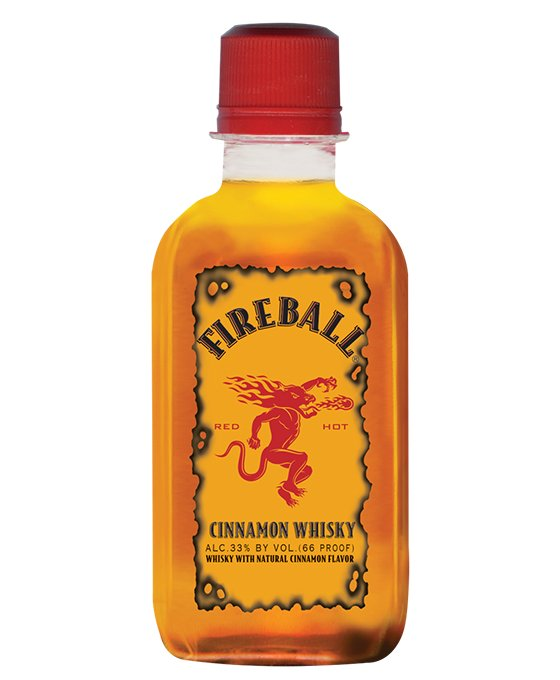
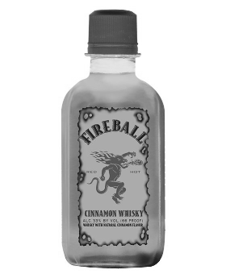
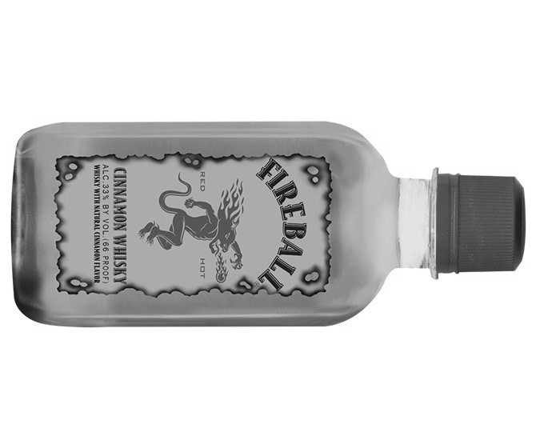
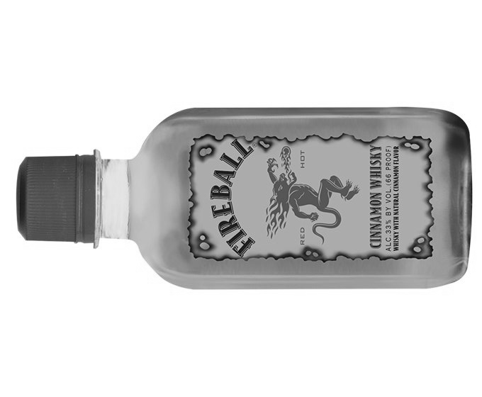

# Image Editor Project

A Python project for basic image processing operations, including grayscale conversion, blurring, resizing, rotation, and multi-scale patch matching. This project uses a clean structure and a helper module for image handling.

## Features

- Convert colored images to grayscale
- Apply blur using a customizable kernel
- Resize images with bilinear interpolation
- Rotate images 90° left or right
- Find a patch in an image across multiple scales and rotations

## Usage

To run the demo script:

```bash
python demo.py
```
This will process the images in \examples and save the output images in the same folder. The console will print messages about each step.

## Example Outputs

Original Image:



Grayscale Conversion:


Blurred Image:


Resized Image (50% scale):



Rotated Images (90° Right and Left):




Patch Matching:
The console will display patch locations for multi-scale and rotated patches.


## Requirements

- Python 3.7+
- Pillow library (`pip install pillow`)

## Contributing
Contributions are welcome. Feel free to fork the repository, add new features, and submit a pull request. Make sure to follow the existing code style.

## License
This project is licensed under the [MIT License](LICENSE).